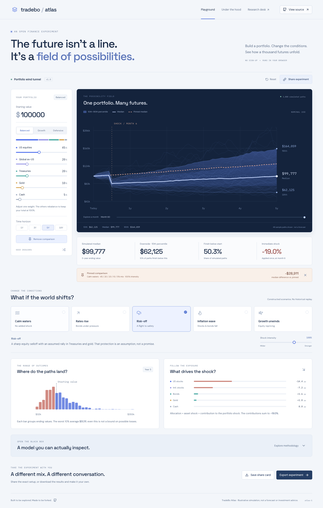

<div align="center">

# TradeBo Atlas

### The future isn’t a line. It’s a field of possibilities.

A portfolio wind tunnel. Build a mix, change the conditions, and explore a thousand simulated futures.

[](https://github.com/Chencharl/Trade_bo/actions/workflows/ci.yml)


[](LICENSE)

[Explore the model](docs/ATLAS_MODEL.md) · [Run locally](#run-it-locally) · [Deploy to Pages](#put-it-on-github-pages) · [Research desk](docs/RESEARCH_DESK.md)



</div>

Most portfolio dashboards tell you what happened. Atlas lets you play with **what could happen under a set of assumptions**. Drag an allocation slider, trigger a market shock, and watch a field of possible outcomes take shape. Pin a setup and compare it with another using the same random draws.

The whole playground runs in your browser. No account, market-data subscription, API key, or backend is needed.

## Take a 60-second tour

1. Start with **Balanced**, **Growth**, or **Defensive**, then make the allocation your own.
2. **Pin this setup to compare**. Apply **Risk-off** or **Inflation wave** and look at both the median and downside.
3. Adjust shock intensity. Trace the impact back to each asset’s weight and assumed shock.
4. Open **Under the hood** to inspect inputs, correlations, equations, and a table of chart values.
5. **Share experiment** to send the exact setup, or save an editable SVG card and a JSON report.

## What makes it interesting

| Feature                             | What it demonstrates                                                                                                             |
| ----------------------------------- | -------------------------------------------------------------------------------------------------------------------------------- |
| **The possibility field**           | 1,000 seeded monthly simulations, percentile bands, 48 example paths, and a keyboard-accessible time scrubber.                   |
| **A portfolio that stays balanced** | Integer allocation sliders redistribute the remaining weights proportionally and always sum to 100%.                             |
| **A common experiment**             | Pinned and current portfolios share the same capital, horizon, and random draws, making comparisons reproducible.                |
| **Explainable shocks**              | Five constructed scenarios with visible asset contributions, one-time price shocks, and persistent volatility changes.           |
| **A shareable result**              | Versioned URL state, SVG share cards, and JSON exports including inputs, assumptions, percentile paths, and all terminal values. |
| **A transparent engine**            | Pure TypeScript math in a Web Worker, self-hosted fonts, zero runtime data requests, and analytic sanity checks.                 |

This is a simulation and interaction-design project, **not an alpha claim**. Asset assumptions and scenarios are deliberately illustrative. There is no hidden live feed, claimed backtest, or implied expected investment outcome.

## Run it locally

Node.js **22.12 or newer**:

```bash
git clone https://github.com/Chencharl/Trade_bo.git
cd Trade_bo
npm ci
npm run dev
```

Open the URL printed by Vite. The Atlas playground needs only the frontend.

```bash
npm run build
npm run preview
```

### The original research desk

TradeBo also includes the existing Python-powered equity workspace: portfolio weights, news relevance screens, evidence-linked answers, and paper plans. Its synthetic sample uses fictional companies. Provider access is optional and keeps its key on the local server.

```bash
npm run build
python3 -m backend.server
# Open http://127.0.0.1:8765/#research
```

See the [research desk guide](docs/RESEARCH_DESK.md) for setup, scope, and provider configuration. Atlas allocations and the research desk account model are separate experiments.

## Under the hood

```text
Allocation + scenario + seed
           │
           ▼
    Validated inputs ──────────────► Versioned share URL
           │
           ▼
    Simulation Web Worker
    ├─ Weighted drift & covariance
    ├─ Seeded portfolio GBM
    └─ Month-six scenario shock
           │
           ▼
    1,000 terminal values + monthly percentiles
           │
           ├─ Possibility field & comparison
           ├─ Distribution & shock attribution
           └─ JSON report / SVG share card
```

The portfolio is approximated by geometric Brownian motion with a constant allocation. Its volatility comes from a positive-semidefinite covariance model built from two common factors and independent residuals. Scenario shocks occur once at month six; the scenario volatility multiplier applies from that month onward.

**Same model version + same inputs + same seed → same results.** Extending the horizon preserves earlier path segments. No Monte Carlo sample is presented as a forecast or a calibrated probability. The [full specification](docs/ATLAS_MODEL.md) records formulas, assumptions, rounding rules, and known omissions.

## Verify

```bash
npm test                                      # Analytic and invariant tests
npm run format:check
npm run build
npx playwright install chromium               # Once per environment
npm run test:e2e                               # Real-browser interaction tests
python3 -m unittest discover -s tests -v       # Existing research contracts
```

Checks include deterministic cash growth, covariance arithmetic, Monte Carlo mean agreement, month-six shock timing, constant allocation totals, URL validation, export consistency, keyboard controls, mobile layout, and preservation of the research engine’s contracts. CI runs the same checks.

## Put it on GitHub Pages

The included [Pages workflow](.github/workflows/pages.yml) builds and verifies the static frontend. Relative asset paths also support repository subpaths and forks.

1. In **Settings → Pages**, choose **GitHub Actions** as the source.
2. After merging the project onto `main`, run **Deploy Atlas to Pages** from the Actions tab. This workflow deploys on demand.
3. Open the deployment URL shown by GitHub. For this repository, the expected URL is `https://chencharl.github.io/Trade_bo/`.
4. Add that verified URL to the repository’s About section and pin the repository on your GitHub profile.

The workflow uses GitHub’s [official Pages deployment actions](https://docs.github.com/en/pages/getting-started-with-github-pages/using-custom-workflows-with-github-pages). The Python research API stays local; Atlas is entirely static.

## Project map

```text
src/atlas/engine.ts              Assumptions, simulation, allocation & URL contracts
src/atlas/simulation.worker.ts   Background execution and request IDs
src/atlas/Atlas.tsx              Experiment controls, comparison, exports
src/atlas/Charts.tsx             Accessible SVG charts
src/atlas/atlas.css              Responsive visual system
src/App.tsx                     Original research desk
backend/                        Python research API and provider adapter
tests/atlas.test.ts              Numeric and reproducibility contracts
tests/browser/                  Playwright user journeys
docs/ATLAS_MODEL.md              Formulas, assumptions and boundaries
```

## Make it your own

Try a different covariance model, add a constructed scenario, or introduce cash flows with explicit timing rules. Change `MODEL_VERSION` when numerical behavior changes so old experiment links cannot silently acquire new meanings. Keep assumptions visible and pair changes with independent arithmetic checks.

Possible next directions include fat-tailed innovations, time-varying correlations, and a sourced historical calibration mode. They are not implemented in this release.

MIT licensed; bundled fonts retain their [SIL Open Font Licenses](docs/THIRD_PARTY.md). Educational software; not investment advice.
