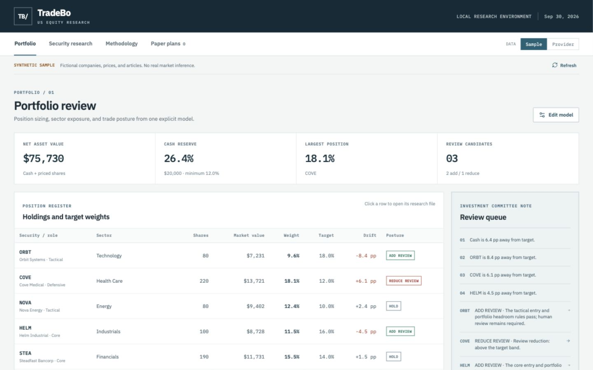

# TradeBo

**A portfolio-first research desk for US equities.** TradeBo connects a security file to an explicit portfolio model: holdings, roles, target weights, sector exposure, cash reserve, risk budget, and review conditions. Its output is a traceable **add review**, **reduce review**, **hold**, or **data hold**. A review is a prompt for human judgment, never a broker instruction.



## What you can inspect

- **Portfolio review:** live-calculated NAV and weights from entered cash, shares, and daily closes; sector and trading-role totals, target drift, concentration alerts, and a review queue.
- **Security research:** price history, descriptive risk measures, company overview, recent ticker-tagged articles, portfolio context, and every passed or blocked rule.
- **Research question:** direct, bounded answers about a selected ticker's add/reduce conditions, allocation, news, fundamentals, or observed risk. Each answer lists its evidence and states when the loaded data cannot answer a question.
- **Paper plans:** draft quantities subject to the current rule ceiling, with no execution or assumed fill. Plans are marked for re-review when the portfolio model changes.
- **Editable model:** cash, whole shares, cost basis, role, target weights, and risk limits. Targets including cash must sum to 100%.

The default sample contains **six fictional companies** and entirely synthetic prices, fundamentals, and articles. Nothing in the sample depicts actual securities or market events.

## Run locally

Requirements: Python 3.10+ and Node.js 22.12+. No database is required.

```bash
npm ci
npm run build
python3 -m backend.server
```

Open `http://127.0.0.1:8765`. For frontend development, run `npm run dev` in a second terminal and open the Vite URL. The local API remains on port 8765.

## Optional market data

TradeBo can load US-listed equities through [Alpha Vantage](https://www.alphavantage.co/documentation/). Keep the API key in the **server environment**; it is never embedded in the frontend bundle.

```bash
export ALPHA_VANTAGE_API_KEY="your_key_here"
export TRADEBOT_SYMBOLS="AAPL,MSFT,NVDA"
python3 -m backend.server
```

Choose **Provider** in the interface. Symbol Search must identify each ticker as `United States / Equity`. The server then requests daily closes, ticker news, and a company overview. The loaded universe is limited to eight symbols. Provider errors and quota limits are surfaced to the user; the interface does not present sample data as provider data. The initial provider-mode portfolio is an explicitly labeled, empty **example model** with $100,000 cash. Enter and verify your own account inputs before interpreting its allocation context. The model stays in the browser session and is sent to the local server for recalculation; it is not persisted.

Provider daily closes are **unadjusted** in this release. Corporate actions, delayed or incomplete feeds, and provider sentiment errors can distort signals. The article filter requires an explicit ticker tag, a timestamp within 72 hours, and a unique URL/headline. Two named sources are only a screening condition; they do not prove independent reporting or verify the article's claims.

## Decision protocol

| Role      | Add review                                                                                                                                                                                                 | Reduce review                                                 |
| --------- | ---------------------------------------------------------------------------------------------------------------------------------------------------------------------------------------------------------- | ------------------------------------------------------------- |
| Core      | Price at or above its 50-day average, no negative recent ticker-tagged article, and available portfolio headroom.                                                                                          | Target-band, position-cap, or sector-cap breach.              |
| Tactical  | Price above its 20-day average above its 50-day average; two positive recent ticker-tagged articles from distinct named sources; no negative article; staged size limited to one third of target headroom. | Target-band, position-cap, sector-cap, or observed downtrend. |
| Defensive | Price at or above its 50-day average, no negative recent article, non-negative reported profit margin, and available headroom.                                                                             | Target-band, position-cap, or sector-cap breach.              |

Every add also requires a known sector, a latest daily close no older than five calendar days, target headroom, the cash reserve, and the single-name/sector/risk-budget limits. The default illustrative limits are 22% per security, 32% per sector, 12% minimum cash, 1% of NAV planned risk per trade, an 8% planning stop distance, and a 4 percentage point drift review band. These are editable **model assumptions**, not universal allocations or a personalized recommendation. The planning stop is a sizing input and cannot guarantee an exit price. A stale or future-dated price pauses both add and reduce reviews.

Portfolio construction begins with the investor's objectives, horizon, and tolerance for loss. The app cannot infer those from a ticker or price series. Read the [research protocol](docs/RESEARCH_PROTOCOL.md) for formulas, evidence limits, and the open-source projects that informed this design.

## Verification

```bash
npm run format:check
npm run build
python3 -m unittest discover -s tests -v
```

The tests cover NAV and weight arithmetic, target validation, stale prices, duplicate and unrelated news, cash reserve, sector classification, distinct review outcomes, bounded answers, and US listing checks.

## Project map

```text
backend/data.py       Synthetic fixtures and optional provider adapter
backend/engine.py     Portfolio math, relevance filter, rules, answers
backend/server.py     Local JSON API and in-memory draft register
src/                  React + TypeScript interface
tests/                Decision-contract tests
docs/                 Protocol and screenshots
```

## Scope

This is a local research prototype. It has no broker connection, live order placement, tax-lot model, transaction-cost backtest, adjusted-price engine, or automated rebalancing. Paper drafts vanish when the server restarts. Historical volatility and drawdown describe the available series; they are not forecasts or loss bounds. Verify original articles, issuer filings, data timestamps, and account suitability before using any output in a real decision.
