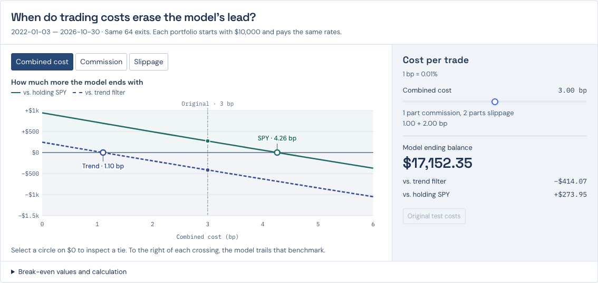

# TradeBo

I built TradeBo to study one question: when a strategy sells to avoid a loss, does it buy back in time for the recovery? Strategy Lab follows the money from the signal at the close to the trade at the next open. You can see what staying in cash saved, what it cost, and how simply holding the market would have worked out.

**[Follow the SPY forward test](https://chencharl.github.io/Trade_bo/#lab-forward)** · [Explore the historical test](https://chencharl.github.io/Trade_bo/#lab)

Three simulated accounts start with $10,000 each. One follows the frozen model, one follows the monthly trend filter, and one holds SPY. Starting November 30, 2026, TradeBo publishes each signal after the New York close and prices any resulting order at the next regular open. Open an exit to see how much of the decline the model avoided, how much of the rebound it missed, and which account came out ahead after costs. [Forward-test rules and public receipts](docs/STRATEGY_SPY_FORWARD.md)

## What happened with SPY?

From January 2022 through October 2026, a neural model spent 69 trading days in cash. On a $10,000 account it finished **$273.95 ahead of buy-and-hold** after simulated fees and slippage. Two exits in April 2025 added $2,707.11 to the final balance. The other 62 together gave back $2,433.16.

The model still had a deeper loss from its peak than SPY, and a monthly trend filter finished $414.07 ahead of it. Click either April exit on the chart to compare the portfolios over those exact trading days. The model weights were fixed before the final test.

## How much can each trade cost?

We replayed the same 64 exits while changing commission and slippage independently. At the original mix of one part commission to two parts slippage, the model’s lead disappeared at **1.10 bp per side against the trend filter** and **4.26 bp against holding SPY**. The original test charged 3 bp per side, between the two thresholds. One basis point is 0.01%.

With slippage held at 2 bp, even zero commission left the model behind trend. Against holding SPY, it could pay about 2.26 bp in commission before its advantage disappeared. [Change the two costs in Strategy Lab](https://chencharl.github.io/Trade_bo/#lab-spy-costs).

[](https://chencharl.github.io/Trade_bo/#lab-spy-costs)

## Explore the project

- **[Strategy Lab](https://chencharl.github.io/Trade_bo/#lab)** compares the model with three baselines. Its [monthly workbench](https://chencharl.github.io/Trade_bo/#lab-workbench) lets you try eight rules on your own data. The [2008 and 2020 replays](docs/STRATEGY_CRISIS_REPLAYS.md) examine when strategies cut exposure during those sell-offs.
- **[Atlas](https://chencharl.github.io/Trade_bo/)** lets you change a portfolio's allocation and simulate market shocks with illustrative assumptions.
- **[Research desk](docs/RESEARCH_DESK.md)** runs locally for reviewing holdings and paper trade plans.

Strategy Lab and Atlas run in your browser without an account. All trades shown here are simulations.

## Run locally

Use Node.js 22.12 or newer.

```sh
git clone https://github.com/Chencharl/Trade_bo.git
cd Trade_bo
npm ci
npm run dev
```

[Reproduce the SPY results](docs/STRATEGY_SPY_DAILY.md#reproduction) · [Development and tests](CONTRIBUTING.md) · [MIT license](LICENSE) · [Data and third-party notices](docs/THIRD_PARTY.md)

A personal project by [Chen Yang](https://github.com/Chencharl).
